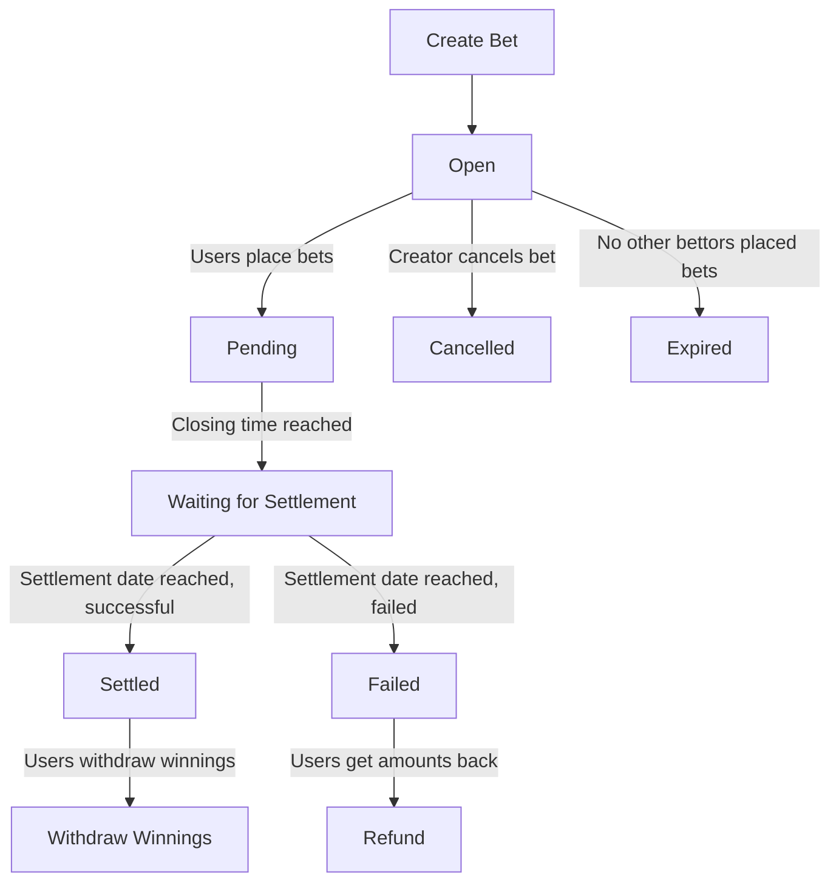

# Parimutuel Pool Bets on Cryptocurrency Prices

## Introduction
Parimutuel betting is a unique system where all bets are placed into a pool, and the odds are calculated based on the total amount bet on each outcome. This guide will walk you through the user flow for participating in a Parimutuel pool bet on the OCI/XRD price using the Ociswap DEX Oracle. The pool bets and other types of bets, like P2P bets, are provided by the DELPHIBETS protocol, a set of smart contract running decentralized on the Radix DLT smart contract network.

## Table of Contents
1. [Overview](#overview)
2. [Creating a Pool Bet](#creating-a-pool-bet)
3. [Betting Process](#betting-process)
4. [Bet States](#bet-states)
   - [Open](#open)
   - [Cancelled](#cancelled)
   - [Pending](#pending)
   - [Expired](#expired)
   - [Settled](#settled)
   - [Failed](#failed)
5. [Settlement Price Calculation](#settlement-price-calculation)
6. [Fees](#fees)
7. [FAQs](#faqs)
8. [Glossary](#glossary)

## Overview
Parimutuel pool bets allow users to bet on the future price of a cryptocurrency, such as OCI/XRD. The outcome is determined by comparing the settlement price to a reference price at a specified future date and time. Bets are facilitated through DELPHIBETS protocol, a betting protocol powered by smart contracts on the Radix DLT network.

## Creating a Pool Bet
### Steps:
1. **Initialize Bet**: 
   - Choose the cryptocurrency pair (e.g., OCI/XRD).
   - Choose the betting currency (e.g., DPH or XRD).
   - Set the reference price.
   - Define the settlement date, the closing time is set automatically.
   - The Oracle for price settlement is predetermined by the selected price pair.
   Example: OCI/XRD uses the Ociswap DEX Oracle (TWAP over 5 minutes).

2. **Set initial bet amounts**: 
   - Optionally place initial bets on one or both outcomes to make the bet attractive.

3. **Set Creator Fees**:
   - **Protocol Fee**: Fixed at 1.5%.
   - **Creator Fee**: Dependent on the amount of DPH (DELPHIBETS' protocol governance and utility token) locked by the creator for the duration of the bet.

4. **Publish Bet**: 
   - The bet becomes available for others to participate.
   - State: **Open**

#### Example:
Creating a Pool Bet on OCI/XRD:
- Reference Price: 1.14 XRD
- Settlement Date: 2024-07-01 12:00 UTC
- Closing Time: 2024-06-30 12:00 UTC
- Betting Currency: DPH
- Initial Bet: 100 DPH on "Price Higher"
- Oracle: Ociswap DEX Oracle (5-min TWAP)
- Protocol Fee: 1.5%
- Locked DPH: 20000 DPH
- Creator Fee: 0.5% (based on locked DPH)

## Betting Process
1. **Place Pool Bets**:
   - **Open Pool Bet Page**: View available bets.
   - **Choose Bet**: Select the bet you want to participate in.
   - **Place Bet**: Enter the amount and select the outcome (e.g., higher or lower than reference price).
   - **Confirm Bet**: Review and confirm your bet by signing the transaction in the Radix wallet.

2. **Monitor Bet Status**:
   - **Real-time Updates**: See the total amount bet on each outcome and the evolving probable odds (upcoming feature).

3. **Closing Time**:
   - Betting closes, and no more bets can be placed.
   - Final odds are determined based on the total amounts bet on both outcomes.

## Bet States

### Open
- **Description**: Bet is open for participation.
- **Conditions**: 
  - Bets can be placed.
  - Bet creator can cancel the bet if no other bets have been placed.

### Cancelled
- **Description**: Bet is cancelled by the creator.
- **Conditions**: 
  - Can be cancelled before closing time.
  - Only if no other bets have been placed.
  - Initial amounts (minus fees) returned to the creator.

### Pending
- **Description**: Betting is closed, waiting for settlement.
- **Conditions**: 
  - Current time is past the closing time.
  - No new bets can be placed.
  - Waiting for the settlement date.

### Expired
- **Description**: No other bettors placed a bet before closing time.
- **Conditions**: 
  - Only the creator's initial amounts were bet.
  - Initial amounts (minus fees) returned to the creator.

### Settled
- **Description**: Bet has been settled with a final price.
- **Conditions**: 
  - Current time is past the settlement date.
  - A final settlement price is recorded.
  - Winning users can withdraw their winnings based on final odds.

### Failed
- **Description**: Bet failed to settle.
- **Conditions**: 
  - Current time is past the settlement date.
  - No final settlement price was recorded.
  - All users get their amounts (minus fees) returned.

## Settlement Price Calculation

#### Oracle-Based Calculation:
- **Ociswap DEX Oracle**:
  - **Method**: TWAP (Time-Weighted Average Price) over 15 minutes.
  - **Details**: The price is averaged over trades on the Ociswap DEX to determine the final settlement price.

## Fees
- **Protocol Fee**: A fixed fee of 1.5% is taken from the total pool.
- **Creator Fee**: An additional fee set by the creator, dependent on the amount of DPH locked.
  - **DPH Locking**: The more DPH the creator locks, the higher the percentage of the creator fee.
  - **Withdrawal**: The creator can withdraw earned fees at any time during or after the bet. After the bet is finished, the creator can also withdraw their locked DPH and any initial bet amounts (if the bet expired or failed).

#### Example:
Fees:
- Protocol Fee: 1.5%
- Creator Fee: 0.5% (based on 20000 DPH locked)

#### Flowchart of Bet Lifecycle

### FAQs

**Q1: How do I know if I won?**
- After the settlement date, check the status of the bet. If it is settled, the winning outcome and the final price used for settlement will be indicated, and you can withdraw your winnings based on the final odds.

**Q2: What happens if the bet is cancelled or expired?**
- If a bet is cancelled by the creator before the closing time and no other bets have been placed, the creator gets their initial amounts back minus any applicable fees. If the bet expires because no other bettors placed bets, the creator gets their initial amounts back minus fees.

**Q3: Can I withdraw my bet before the closing time?**
- No, once a bet is placed, it is locked until the bet is settled or expired.

**Q4: What if the bet fails to settle?**
- If the bet fails to settle (no final settlement price is recorded), all users get their bet amounts back minus any applicable fees.

**Q5: How are the fees calculated and withdrawn?**
- A protocol fee of 1.5% is taken from each bet. The creator can set an additional fee based on the amount of DPH locked. The creator can withdraw earned fees at any time during or after the bet. After the bet is finished, the creator can also withdraw their locked DPH and any initial bet amounts (if the bet expired or failed).

### Glossary

- **TWAP**: Time-Weighted Average Price, a method of averaging the price of an asset over a specified time period.
- **Oracle**: A service that provides external data, such as cryptocurrency prices, to smart contracts to execute based on real-world information.
- **Settlement Date**: The predefined date and time when the final price is determined, and the bet is settled.
- **Closing Time**: The deadline after which no new bets can be placed.
- **DPH**: DELPHIBETS' protocol governance and utility token.

---
